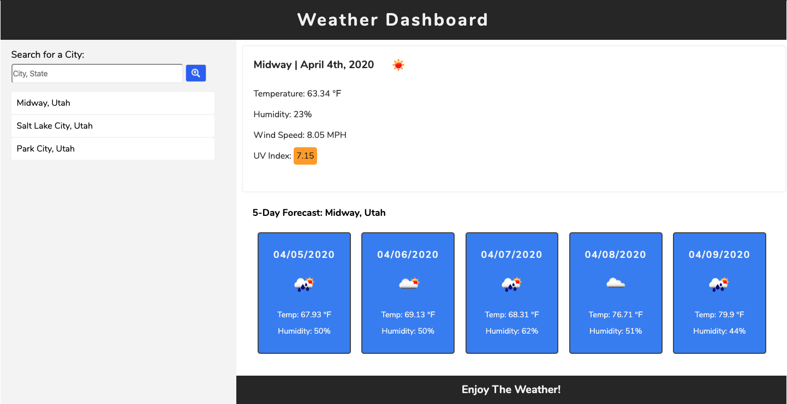

### Project Name

# Weather Dashboard



- [View Site](https://nvalline.github.io/weather-dashboard/)

> This application allows you to stay up-to-date on the current weather & the forecast for cities around the nation.  

---

### Table of Contents

Your section headers will be used to reference location of destination.

- [Description](#description)
- [How To Use](#how-to-use)
- [References](#references)
- [License](#license)
- [Contributors](#contributors)

---

## Description

This weather dashboard allows the user to search multiple cities to discover the current weather with it's five day forecast. As the user searches additional cities, the application will display the search history in which the user is able to click those historical and review the weather data again. This search history is also saved to the user's local storage which allows the history to be available when the user returns to the site.

#### Technologies

- HTML 5
- CSS 3 (CSS Grid & Flexbox)
- Javascript
- jQuery
- Moment.js
- fontawesome
- jQuery Modal

---

## How To Use

Simply load the application in your browser and away you go.

Enter a city and state in the input to begin your search. The application will then do a few things.
- Add the search term to the search history list
- return the current weather for the search term
- return the five day forecast for the search term

The user may then enter new search terms, or select locations from the search history.

These search terms will persist if the user leaves the application and will repopulate upon return.

#### Installation

Open this link to view teh Weather Dashboard.

- [View Site](https://nvalline.github.io/weather-dashboard/)

#### Code Samples

```javascript
init();

// Click event for search button
$('#search-btn').on('click', newSearch)
// Click event on search history
$('#search-history-ul').on('click', previousSearch)

function newSearch(event) {
    event.preventDefault();

    let searchLocationValue = $('#search-input').val().trim().toLowerCase();

    if (searchLocationValue === '') {
        return
    } else {
        searchLocations.unshift(searchLocationValue)
        if (searchLocations.length > 10) {
            searchLocations.pop();
        }
    }

    getCurrentWeather()
    getForecast()
    printSearchLocations()
    storeLocations()

    $('#search-input').val('')
}
```
```html
<!-- section - current weather -->
        <section id="current-weather">
            <div>
                <!-- h2 - city/date/icon -->
                <h2 id="current-city">Search A City</h2>
                
            </div>
            <!-- p - temp. -->
            <p>Temperature: <span id="current-temp"></span> &#8457</p>
            <!-- p - humidity -->
            <p>Humidity: <span id="current-humidity"></span>%</p>
            <!-- p - wind speed -->
            <p>Wind Speed: <span id="current-wind"></span> MPH</p>
            <!-- p - UV index - color coded -->
            <p>UV Index: <span id="current-uvi"></span></p>
        </section>
```
```css
.container {
    display: grid;
    grid-template-areas: 
        "head head"
        "side prime"
        "side second"
        "side foot";
    grid-template-rows: 8vh 290px 1fr 8vh;
    grid-template-columns: 30% 1fr;
    margin: 0 auto;
    max-width: 1440px;
    width: 80%;
}
```

[Back To The Top](#project-name)

---

## References

- Nate Valline
- [jQuery Modal](https://github.com/kylefox/jquery-modal#installation)
- [Open Weather](https://openweathermap.org/api)
- [MDN Web Docs](https://developer.mozilla.org/en-US/)
- [W3Schools](https://www.w3schools.com/)
- [Google](https://www.google.com) 

[Back To The Top](#project-name)

---

## License

Copyright (c) 2020 Nate Valline

[Back To The Top](#project-name)

---

## Contributors

- Nate Valline

[Back To The Top](#project-name)

